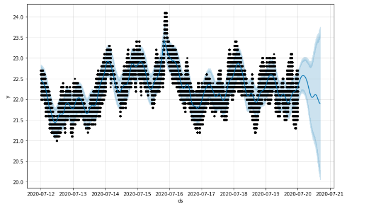

# voltron - sensors

We have the task of helping monitoring vineyards with data that should comes from multiple sensors on the spot.
We will try to do forecasting on our different data in order to be aware of future trends.   

## Data
Since we didn't have actual data from our devices, we decided to look for data that looks like our in format, frequency and that may reprents different environments.
We used [Environmental Sensor Telemetry Data](https://www.kaggle.com/datasets/garystafford/environmental-sensor-data-132k) with kaggle api.  
Three IoT devices(Raspeberry pi) were placed in different location with environmental conditions.  
Data are timeseries from Kaggle from 07/12/2020 to 07/19/2020.

**Dataset columns**:    
> **ts**: timestamp  
> **device**: device id  
> **co**: carbon monoxyde  
> **humidity**: humidity  
> **light**: light boolean  
> **lpg**: liquid petroleum gas      
> **motion**: motion boolean  
> **smoke**: smoke  
> **temp**: temperature

## Forecasting
We used a tool for forecasting - [prophet](https://facebook.github.io/prophet/) which is great to build model from timeseries.  
We'll fit a model with 2 columns: 
- timeseries which correspond to our sensor timestamp
- "y" which is the value evoluting and that our model will try to learn from.

We must configure the seasonality which corresponds to sub-pattern of our data.  
For example for our temperature it has a daily pattern, temperature tends to be cooler during night and warmer during the day. 
In order to use our model we use `make_future_dataframe` method specifyng the numbers of periods and a frequency of 4 seconds to match our data.  

## Metrics

In order to validate the model, we use cross-validation which measure forecast errors using historical data.  
We do this with prophet `cross_validation` and give us the comparison between expected result and predicted result.  

You'll find in this module:
* `sensor-forecasting.ipynb`: Notebook poc that analyze, plot and build prediction model. Here's also a [link of the notebook](https://colab.research.google.com/drive/1N1kwqJUR7R4a8p_EaSK0jUgyxODfwikI?usp=sharing) with cells already launched.
* `report-sensor-iot.html`: profiling report of dataset.
* `build_model.py`: build model locally. Install requirements needed. Use the Environmental Sensor Telemetry Data dataset.
* `requirements.txt`: libraries, install in virtual environment. 
